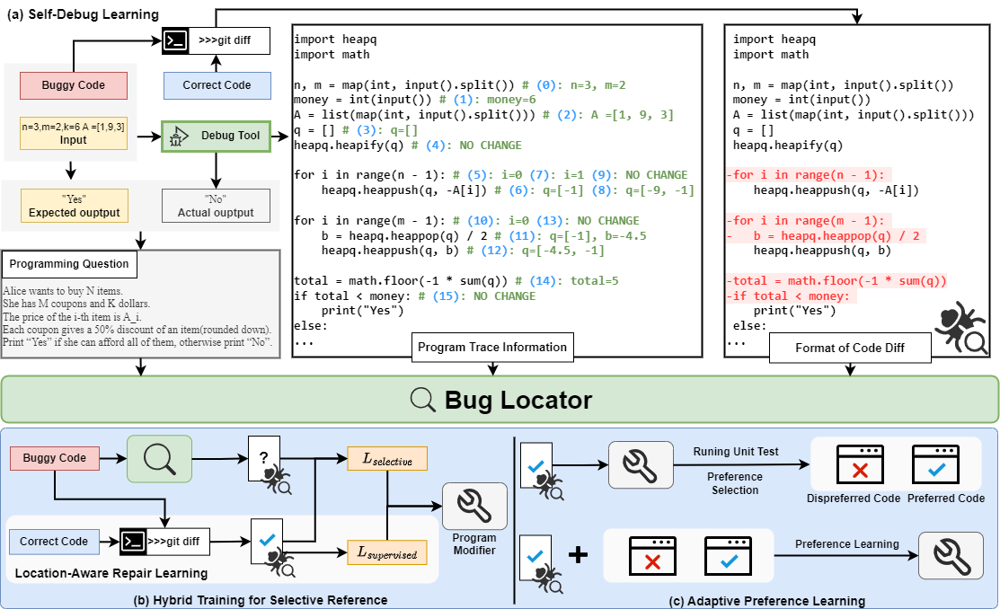

# AdaPatcher
### Paper Title: Adaptive Program Repair with Bug Localization and Preference Learning

<figure>
  
  <figcaption>Overview of AdaPatcher:(a) Illustration of the Self-Debug Learning process. (b) Illustration of the Hybrid Training for Selective Reference process. (c) Illustration of the Adaptive Preference Learning process.</figcaption>
</figure>

### Installation
1. Git clone our repository
2. creating conda environment:
```shell
conda create -n LLMenv python=3.8
conda activate LLMenv
conda install pytorch torchvision torchaudio pytorch-cuda=12.1 -c pytorch -c nvidia
pip install --upgrade transformers
conda install psutil
pip install peft
pip install sentencepiece
pip install deepspeed

git clone https://github.com/huggingface/alignment-handbook.git
cd ./alignment-handbook/
python -m pip install .
```

### Dataset download
you can download dataset from https://huggingface.co/datasets/ZhenlongDai/ACPR.
#### 1. test cases
Download it and place it in the directory ./merged_test_cases.
#### 2. Programming problem file
Update as soon as possible...
Problem file in  ./repairDataset/Program_Question_Data/English_Program_Question_StringVersion.json
#### 3. train/dev/test file
Update as soon as possible...
file in  the directory ./repairDataset/RepairData-PythonLevel/CRFLPDataset/

### Code execution environment construction
View codeTool/use.md

### LLM weight download
Please download the pre-trained [CodeLlama-7b-Instruct-hf](https://huggingface.co/codellama/CodeLlama-7b-Instruct-hf) weights from huggingFace and put it in the same directory "./CodeLlama-7b-Instruct-hf".
### Stage I Training
#### step 1.firstly need train a base Program Modifier(Location-Aware Repair Learning) for eval bug locator
DATA_FILE="CRFLPDataset"
```
bash script/pipeline/process_fixbycrflp.sh
```
#### step 2.trian bug locator
The script is executed after specific parameter values are specified based on the result of step 1.
DATA_FILE="CRFLPDataset"
```
bash script/pipeline/process_trace_CRFLP.sh
```

### Stage II Training
#### step 1.firstly need train a Program Modifier with Hybrid Training for Selective Reference
The script is executed after specific parameter values are specified.
DATA_FILE="mixCRFLPDataset"
```
bash script/pipeline/process_SecondFix.sh
```
#### step 2. generate perference data by Program Modifier
##### step 2.1. Merge PEFT weights with base LLM weights
```
bash script/merge_sft.sh
```

##### step 2.2. Adaptive Preference Learning
The script is executed after specific parameter values are specified.
```
bash script/Prefer/generate_prefer_data.sh
```
then you should constrcut generation result to training data.
you can refer to "./utils/ConstructPerferDataset.py", we screened the data pairs with the highest and lowest consistency greater than 0.1 difference.
You also can directly use perference data "dataNew/FixPerferdataset"

#### step 3.training Program Modifier with Adaptive Preference Learning
PerferDATA_FILE="dataNew/FixPerferdataset"
```
bash script/pipeline/Prefer/process_Prefer_FixModel.sh
```

### Evaluate generated results
#### 1. Test the generated code using test cases
The script is executed after specific parameter values are specified.
```
bash cript/Execution/Execution_Eval.sh
```
#### 2. Evaluate generated results(ACC/Improve/Consistency) by script
The script is executed after specific parameter values are specified.
```
bash script/Postprocessing.sh
```

### Program Modifier and Bug Locator weight download
1. **base Program Modifier**<br>
  the file of weight: "./output_dir/loraWeight/fixbycrflp/checkpoint-8000" <br>
  the file of predict result: "./predict_dir/loraWeight/fixbycrflp/test-checkpoint-8000.json"
2. **bug locator**<br>
  the file of weight: "output_dir/loraWeight/trace_CRFLP/checkpoint-14000"<br>
  the file of predict result: "./predict_dir/loraWeight/trace_CRFLP/test-checkpoint-14000.json"
3. **Program Modifier with Hybrid Training for Selective Reference**<br>
  the file of weight: "./output_dir/loraWeight/fixbycrflp2/checkpoint-12000"<br>
  the file of predict result: "./predict_dir/loraWeight/fixbycrflp2/test-checkpoint-12000.json"
4. **merge_sft**<br>
  the file of weight: "./output_dir/fix_codeLlama"<br>
5. **Program Modifier with Adaptive Preference Learning**<br>
  the file of weight: "./output_dir/DpoWeight/DPOP_Fix_ND3V1/checkpoint-1300"<br>
  the file of predict result: "./predict_dir/DpoWeight/DPOP_Fix_ND3V1-GEN/test-checkpoint-1300.json"